# PyGObject examples

| libhandy           | screenshot                                                 |
| ------------------ | ---------------------------------------------------------- |
| 1-box.py           |                      |
| 2-headerbar.py     | 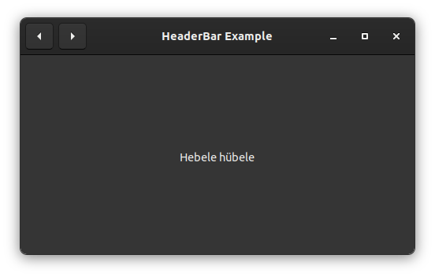         |
| 3-revealer.py      | 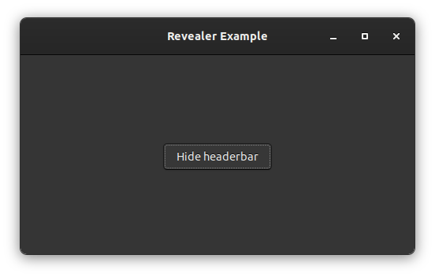           |
| 4-stack.py         | 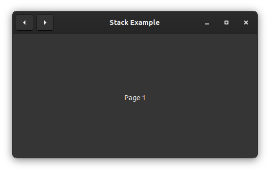                 |
| 5-style-classes.py | 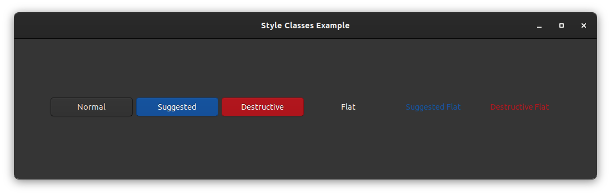 |
| 6-deck.py          |                    |

| libadwaita         | screenshot                                                     |
| ------------------ | -------------------------------------------------------------- |
| 1-hello-world.py   | 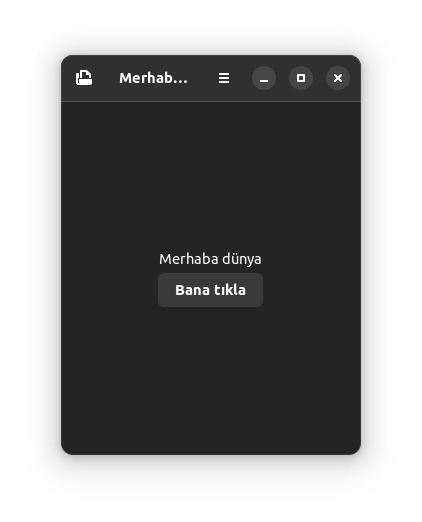     |
| 2-buttons.py       | 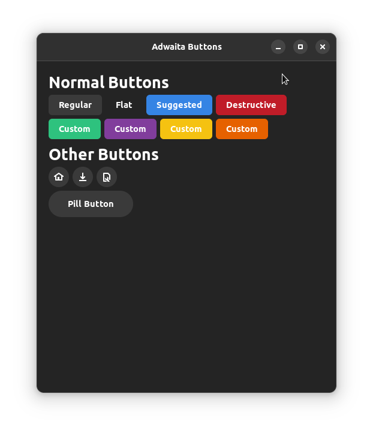            |
| 3-leaflet.py       | 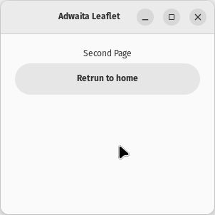            |
| 4-clamp.py         | 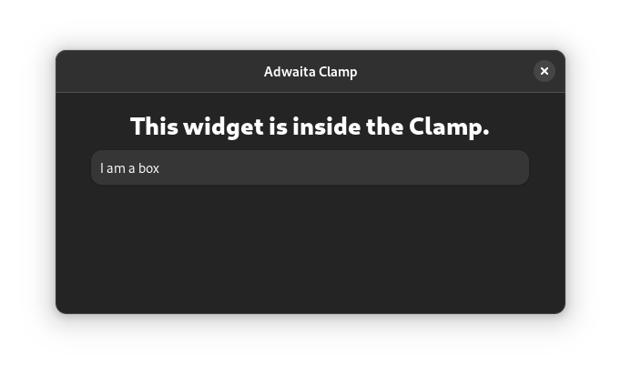                |
| 5-lists.py         | 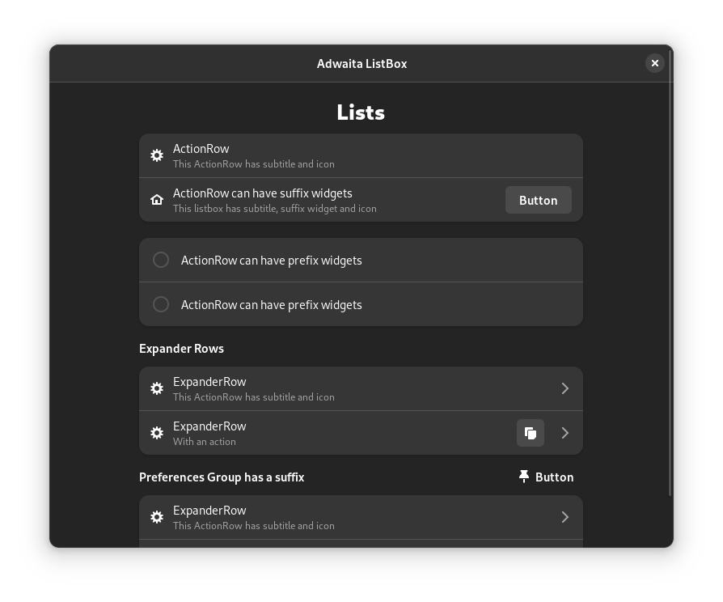                |
| 6-view-switcher.py | 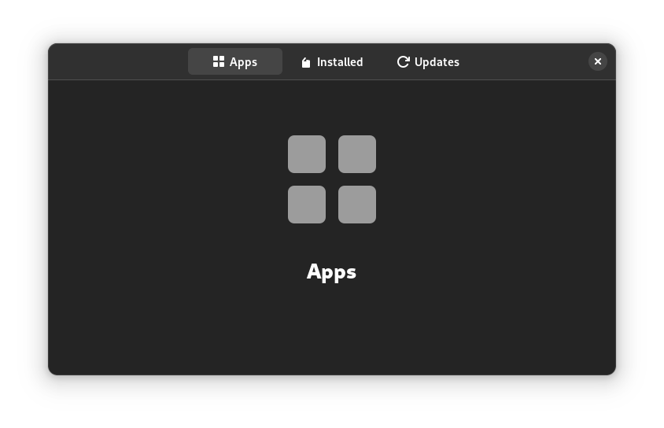 |
| 7-carousel.py      | 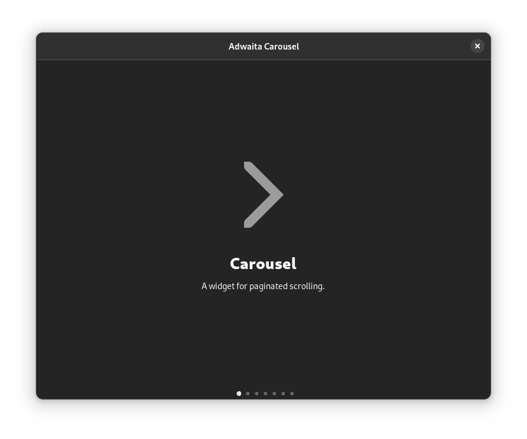          |

## Requirements:

- Python 3
- GTK+ 3.0 (4.0 for libadwaita)
- Handy 1.0
- Libadwaita 1.0
